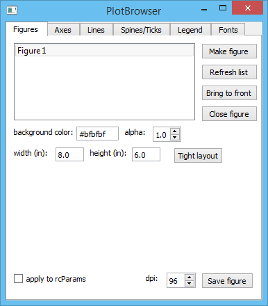
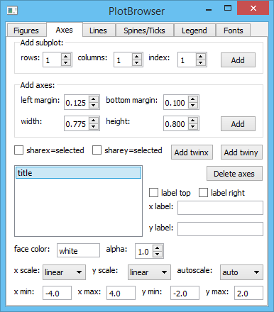
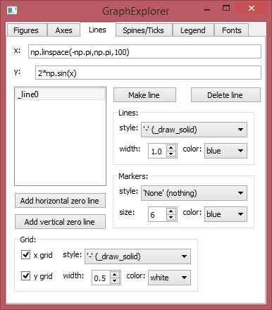
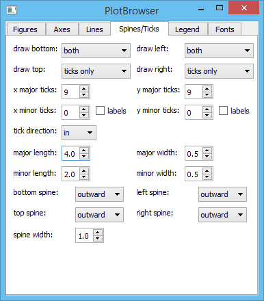
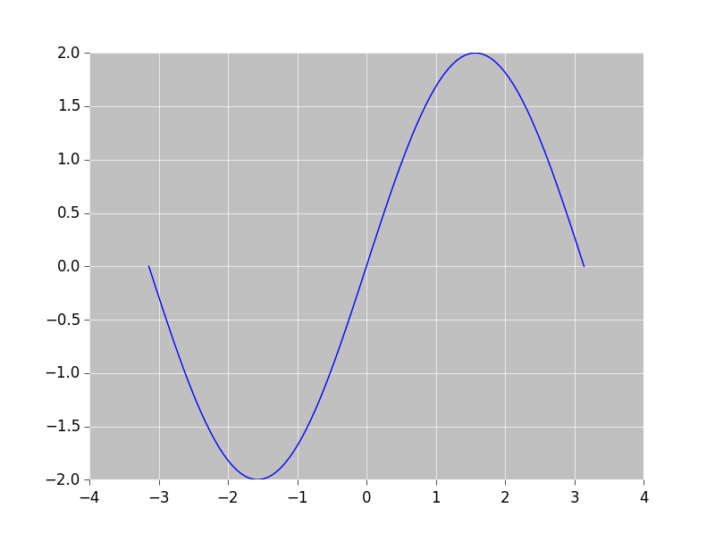
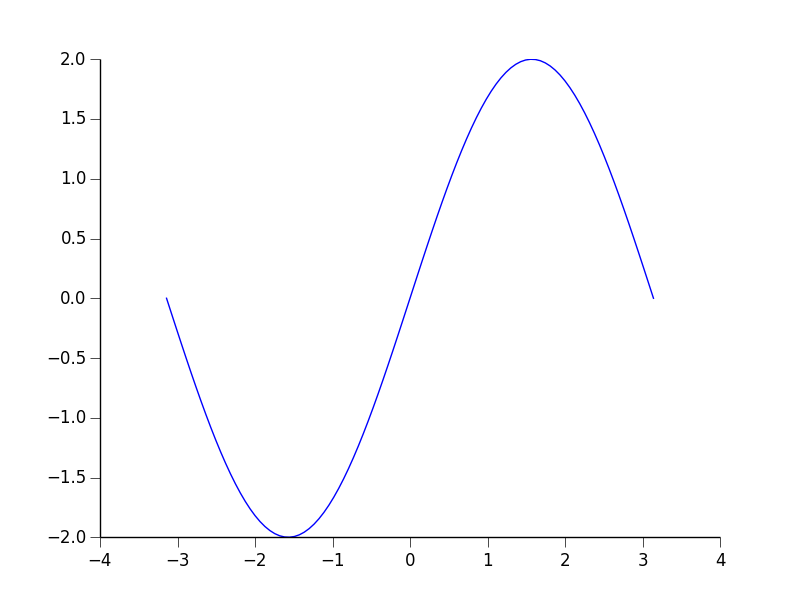

plotbrowser
===========

A GUI to change the appearance of matplotlib plots, useful for quick tweaks of plots and for finding the matplotlib syntax to do something (just read the method connected to the widget!). Uses the object-oriented interface of matplotlib when possible.

Written in Python 2.7 and PySide 1.2, with the help of Qt Designer. Python 3 and PyQt4 should also work but not fully tested. IPython with the qtconsole is required so that you still have access to the shell when the GUI comes up.

To do: option to make changes the default by editing rcParams or the matplotlibrc file.

Requires:
- ipython
- numpy
- matplotlib
- pyside or pyqt4

Installation
-----------

```sh
cd plotbrowser
python setup.py install
```

Usage
-----------

Once installed:
```python
import plotbrowser
plotbrowser.plotbrowser.run() 
```

Or to run as a script:
```sh
run plotbrowser/plotbrowser.py
```

If you want to use the GUI to make the initial plot, first create a figure, then a subplot or axes, then a line. Or make plots the normal way with the interactive shell or a script, then click "refresh list" in the GUI to update the figure list widget. One feature that may not be apparent is that you can double-click an item in the list widgets of figures, axes, and lines to change the window title, axes title, and line label respectively.

Screenshots
-----------









By changing a few things, we can get ggplot style plots...



or Origin / Igor Pro style...


