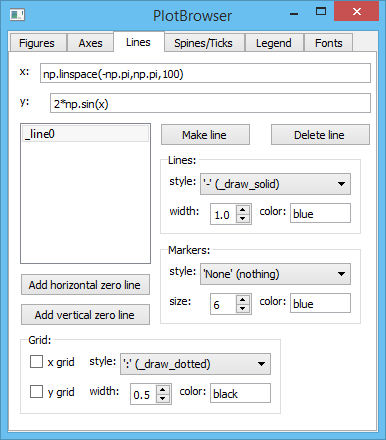

plotbrowser
===========

A GUI to change the appearance of matplotlib plots, useful for quick tweaks of plots and for finding the matplotlib syntax to do something (just read the method connected to the widget!). Uses the object-oriented interface of matplotlib when possible.

Written in Python 2.7 and PySide 1.2, with the help of Qt Designer. Python 3 and PyQt4 should also work but not fully tested. IPython with the qtconsole is required so that you still have access to the terminal when the GUI comes up.

Double-click an item in the lists of figures, axes, and lines and edit its name to change the window title, axes title, and line label respectively.

To do: option to make changes the default by editing rcParams or the matplotlibrc file.

Requires:
- ipython
- numpy
- matplotlib
- pyside or pyqt4
- webcolors

Run in a terminal:
```sh
ipython --pylab=qt
run /path/to/plotbrowser.py
```

Screenshots
-----------





By changing a few things, we can get ggplot style plots...


or Origin / Igor Pro style...


